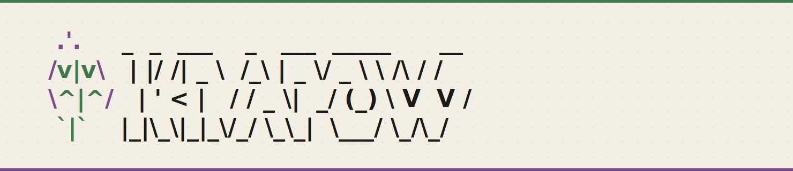

<p align="center">
  
</p>

# Krapow: Easy GitHub Actions Runners

<a href="https://github.com/rossturk/krapow" target="_blank"></a>
<a href="https://goreportcard.com/report/github.com/rossturk/krapow" target="_blank"></a>
<a href="https://github.com/rossturk/krapow" target="_blank"></a>

```
   .'.     _  _  ___    _   ___  _____      __
  /v|v\   | |/ /| _ \  /_\ | _ \/ _ \ \ /\ / /
  \^|^/   | ' < |   / / _ \|  _/ (_) \ V  V / 
   `|`    |_|\_\|_|_\/_/ \_\_|  \___/ \_/\_/  
```

Krapow is a tool for managing GitHub Actions self-hosted runners on *macOS* and *Linux*. A single-command builds a Linux, Mac, or Windows VM and registers it as a runner against your repo.


## Why

GitHub's runners cost money. The free tier is almost enough to give you satisfaction, but then you quickly hit quota just before your first successful run. They work great, but if you're not working on a revenue-generating project you might not want to pay for them.

Self-hosted runners are a hassle. Yeah, the setup process is just a script; they're made to be easy to spin up. But do you have spare machines laying around? Do you know how to keep them from falling asleep? It's not hard, and a lot of us have solved these problems, but it's still painful every time we have to go in and muck with them.

I had previously used amazing tools like [mac-runner](https://github.com/omniaura/mac-runner) and deployed [runner-images](https://github.com/actions/runner-images) in Docker, but neither of these solutions handled Windows well and they behaved differently across platforms.

With Krapow, one tool works the same on every platform  + every kind of runner.

## Install

### Homebrew

```sh
brew tap cirruslabs/cli      # provides tart (krapow's macOS VM backend)
brew tap rossturk/krapow     # provides the krapow formula
brew install krapow
```

Linux hosts use Incus, which isn't in Homebrew — install it from your distro (`apt install incus` on Ubuntu/Debian). After installing, `krapow doctor` will tell you exactly what's missing.

### Install script

Downloads the latest release tarball for your OS/arch and drops the binary in `~/.local/bin/krapow`:

```sh
curl -fsSL https://raw.githubusercontent.com/rossturk/krapow/main/install.sh | bash
```

Override the install location with `KRAPOW_INSTALL_DIR=/usr/local/bin` (write permission is required).

## GitHub token

`krapow` resolves a token in this order:

1. `GITHUB_TOKEN` environment variable
2. `PAT` environment variable 
3. `gh auth token` (if [GitHub CLI](https://cli.github.com/) is installed and authenticated)

Classic PATs need the `repo` scope. Fine-grained PATs need **Administration: read & write** on the target repo (this is where the runner-registration token comes from).

## Quickstart

```sh
# Linux runner (Ubuntu Noble on Linux hosts via Incus; Ubuntu ARM on macOS hosts via Tart)
krapow init linux --repo owner/name

# Windows runner (Server 2022; bakes the base image on first run, ~45–90 min)
krapow init win --repo owner/name

# macOS runner (Sequoia + Xcode, macOS hosts only)
krapow init mac --repo owner/name
```

Each `init` boots a VM, installs the GitHub Actions runner, registers it against `--repo`, and starts it as a service. The runner name defaults to `<platform>-runner-<6 random chars>`; override with `--name`.

Day to day:

```sh
krapow status                       # list managed runners + their VM/GitHub state
krapow shell   linux-runner-ab12cd  # open an interactive shell on a runner
krapow stop    linux-runner-ab12cd  # power off the VM (registration intact)
krapow start   linux-runner-ab12cd  # boot it back up; agent reconnects on its own
krapow destroy linux-runner-ab12cd  # delete VM + state + GitHub registration
```

## Commands

| Command | What it does |
| --- | --- |
| `krapow init linux\|win\|mac` | Create a runner VM and register it with GitHub |
| `krapow bake` | Build/rebuild the Windows base image (used implicitly by `init win`) |
| `krapow status` | List krapow-managed runners with VM + GitHub state |
| `krapow shell <name>` | Open an interactive shell on a runner (`-- cmd args` for one-shot) |
| `krapow stop <name>` | Stop the VM (runner stays registered; shows "Offline" in GitHub) |
| `krapow start <name>` | Boot a stopped runner; the agent reconnects automatically |
| `krapow destroy <name>` | Delete the VM and unregister the runner |
| `krapow doctor` | Diagnose host readiness (CLIs, group membership, token scope) |

Every `init` subcommand accepts:

- `--repo owner/name` *(required)* — repository to register against; also accepts full `https://github.com/owner/name` URLs
- `--name <name>` — override the autogenerated runner name
- `--labels <csv>` — comma-separated runner labels (defaults vary per platform)
- `--plain` — disable the interactive TUI and print plain status lines (useful for CI / scripts)

`init win` also takes `-y` to skip the confirmation prompt before kicking off a Windows base-image bake.

## Configuration

VM image sources can be overridden via environment variables when the defaults don't fit (different Ubuntu release, internal mirror, pinned macOS version, etc.):

| Variable | Default |
| --- | --- |
| `KRAPOW_LINUX_IMAGE` | `images:ubuntu/noble/cloud` |
| `KRAPOW_LINUX_ARM_IMAGE` | `ghcr.io/cirruslabs/ubuntu-runner-arm64:24.04` |
| `KRAPOW_WIN_IMAGE` | `local:win-runner-base` |
| `KRAPOW_MAC_IMAGE` | `ghcr.io/cirruslabs/macos-sequoia-xcode:latest` |

The `install.sh` curl|bash installer also honors `KRAPOW_INSTALL_DIR` (default `~/.local/bin`).

State lives under `~/.krapow/state/` — one JSON file per runner. The Windows base image is published into the local Incus image store as `win-runner-base`.

## How it works

`krapow init` runs a sequence of named phases — image pull, VM launch, provisioning, runner install, GitHub registration — surfaced live in a TUI (or as plain text under `--plain` / when stdout isn't a terminal). The Windows path additionally goes through a `bake` step that downloads the Windows Server 2022 eval ISO, runs an unattended install, applies virtio drivers, runs sysprep, and publishes the result as a reusable Incus image. See [`docs/flows.html`](docs/flows.html) for the full state-flow diagram.

## System requirements

The install methods should take care of this for ya, but just in case:

On a Linux host:

- `incus` on PATH and your user in the `incus-admin` group (used for both Linux and Windows runner VMs)
- `sshpass` (only if you'll spawn Windows runners — the Windows image accepts password auth before krapow installs its SSH key)

On a macOS host:

- `tart` on PATH (`brew install cirruslabs/cli/tart`) — used for both macOS and Linux-ARM runner VMs

Run `krapow doctor` any time to check what's missing.

## Building from source

Needs Go 1.25+ and [`just`](https://github.com/casey/just).

```sh
# build into ./krapow
just build

# install into ~/.local/bin (must be on PATH)
just install
```

## Development

```sh
just              # list all recipes
just test         # go test ./...
just lint         # go vet + gofmt check
just doctor       # build and run preflight diagnostics
just rebake       # nuke + rebuild the Windows base image (~45–90 min)
just destroy-all  # tear down every krapow-managed runner
```

`just linux owner/name`, `just win owner/name`, `just mac owner/name` are convenience shortcuts for `krapow init`. `just destroy <name>` mirrors `krapow destroy`.


## License

Apache 2.0 — see [LICENSE](LICENSE).
